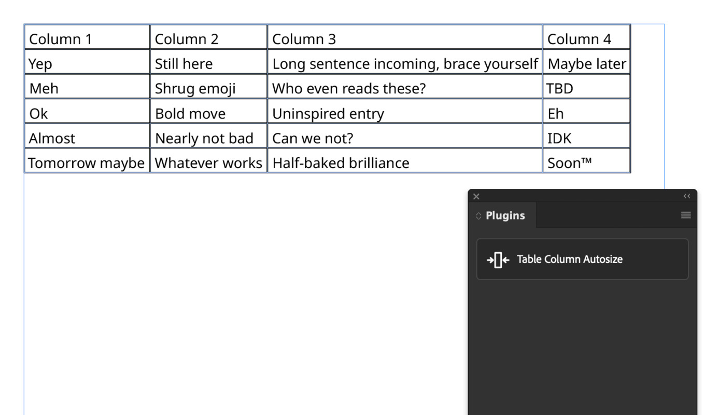

This is a simple plugin that fits table columns to content in
InDesign. It works by adjusting the column width and checking to see if
any column content overflowed.

# Installation

You can install this plugin directly from Adobe Exchange:
<https://exchange.adobe.com/apps/cc/87ac7562/table-column-autosize>

# Getting help

If you found your way here because something is not working correctly,
please add an issue explaining your problem
[here](https://github.com/rogerfarrell/InDesign-table-column-autosize/issues).

# Notes

This plugin is currently optimized for text, so expected behavior is not
guaranteed for cells with graphical content.
